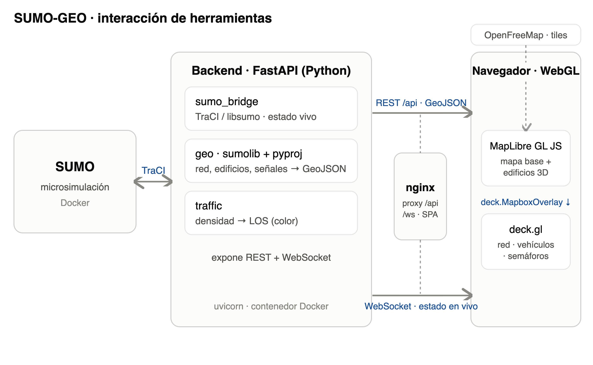

# SUMO-GEO

Web application to **run and visualise SUMO mobility simulations in the browser**,
with **3D buildings**, **real-time traffic estimation (LOS)**, **SUMO-synchronised
traffic lights**, **procedural 3D vehicles**, a **right-click inspector** and a
**live historical-statistics panel**. Everything renders in the browser — no
install, no game engine — on the web-native **MapLibre GL JS + deck.gl** stack
(the same stack that [GeoLibre](https://github.com/opengeos/GeoLibre) productizes).



```
 SUMO (Docker) ──TraCI──► FastAPI backend ──REST──────► network + buildings + traffic lights (GeoJSON)
   (subscriptions)                        └─WebSocket──► vehicles + LOS + signals + fleet stats ──► MapLibre + deck.gl
```

> **Prototype / research preview.** Built at Universidad de Cuenca (Ecuador).
> `docker compose up` starts SUMO, streams live traffic, colours roads by Level
> of Service, draws signalised intersections following SUMO's phases, and plots
> fleet statistics over time.

---

## Features

- **In-browser 3D** — MapLibre `fill-extrusion` buildings + a deck.gl interleaved
  overlay (shared depth buffer: buildings, poles and vehicles occlude correctly).
- **Procedural 3D vehicles** — each vehicle is built from extruded parts (chassis,
  windshield/greenhouse, roof, wheels, head/tail lights, contact shadow) at its
  **real SUMO size and heading**. 100 % offline — no external model servers.
  Automatic **LOD**: with thousands of vehicles or zoomed out, simplified boxes.
- **Scene lighting** — deck.gl `LightingEffect` with a directional sun synced to
  the **light presets** (dawn / day / dusk / night, icon buttons): warm low sun at
  dusk, cool moonlight at night. Basemap re-themed to the exact Mapbox-Standard
  "day" palette (buildings `#f1e5db`, roads `#b3bbd3`, green `#d1edcc`).
- **Real-time traffic estimation** — per-edge density → HCM-style LOS (A–F)
  colour ramp; roads have a dark casing and **lane dividers on 2+ lane streets**.
- **SUMO-synchronised traffic lights** — one signal head per approach at the stop
  line, mast-arm ("ménsula") on open junctions / straight pole elsewhere, coloured
  live from SUMO's phase state, always visible over buildings.
- **Scenario selector** — Bajo / Medio / Alto traffic levels switched from the UI;
  each WebSocket connection drives its own SUMO run.
- **Right-click inspector** — SUMO stats for the object under the cursor:
  *vehicles* (type, speed, heading, size, edge + extended: CO₂, fuel, noise,
  waiting, time loss, distance driven, lane, route progress), *roads* (lanes,
  speed limit, live density/LOS/occupancy), *signals* (state, mounting, approach).
- **Historical panel** — live time series: vehicles by class, fleet CO₂ (g/s),
  mean travel time of arrivals, waiting time at signals, plus a per-type breakdown.
- **Busy-streets layer** — floating teardrop pins with the live vehicle count on
  every street at/above a user-selected threshold.
- **Camera** — unified **Pan-Tilt pad** (bottom-right), zoom, auto-orbit, 2D/3D
  toggle. Panels auto-hide to their title bar.
- **Scalability** — TraCI **subscriptions** (whole fleet in one round trip),
  LOS restricted to **active edges** (O(vehicles), not O(34k edges)) — measured
  **135× faster** frames on the metropolitan net — plus cached static layers and
  throttled recolouring in the browser.

---

## Quick start

```bash
docker compose up --build
# backend  -> http://localhost:8000/api/health
# frontend -> http://localhost:8081
```

Open **http://localhost:8081**. The default scenario is the **Cuenca centro** map
built from OSM (`sumo/cuenca.*`, with 3D buildings). The metropolitan network
(`mapa/`) is available as the commented alternative in `docker-compose.yml`
(its `network.net.xml` is git-ignored — regenerate it, see *Scripts*).

---

## User manual

### Left panel (controls — auto-hides, hover to expand)

| Control | Action |
|---|---|
| ⏸ Pausar / ▶ Reanudar | Pause/resume the simulation |
| ⟳ Reiniciar | Restart the current scenario |
| **Escenario** | Traffic level **Bajo / Medio / Alto** (reconnects to that SUMO run) |
| Velocidad | Playback speed 1–30 fps |
| Edificios | Show/hide **all** buildings (SUMO polygons + OSM basemap) |
| Congestión (LOS) | Toggle congestion colouring (A–F legend at the bottom) |
| Semáforos | Toggle the traffic-light layer |
| PoI | Show/hide basemap points of interest (shops, bus stops…) — hidden by default |
| Calles concurridas + ≥ N veh | Floating pins on streets with ≥ N vehicles (live count) |

### Right panel — Históricos (auto-hides)

Time series sampled once per second (last ~12 min): **Vehículos** (cars vs buses),
**CO₂ flota** (g/s), **Tiempo de viaje medio** (recent arrivals), **Espera en
semáforos** (mean of currently-waiting vehicles), and the live **per-type** count.

### Top bar

`+ / −` zoom · `◐` auto-orbit · `2D/3D` top-down ⇄ perspective ·
light presets: **amanecer · día · atardecer · noche** (sky, sun, palette, tint).

### Pan-Tilt pad (bottom-right)

Drag inside the ring: **horizontal = pan** (bearing, centre = north),
**vertical = tilt** (top = horizon 85°, bottom = top-down). Double-click resets
to north + 55°. The readout shows compass + angles; it follows mouse gestures
and the orbit.

### Right-click inspector

Right-click any **vehicle**, **road**, **signal head** or **busy pin** to open a
stats popup (extended vehicle stats are fetched live from SUMO over the same
WebSocket). Left-click or drag closes it.

> Note: the shipped car fleet uses `vClass="evehicle"` (electric), so CO₂/fuel
> are legitimately 0 for cars; buses do emit.

---

## Scenarios & traffic levels

| Family | Dir | Network | Buildings | Notes |
|---|---|---|---|---|
| **Centro** (default) | `sumo/` | `cuenca.net.xml` (OSM import, ~1×1 km) | ✓ `cuenca.poly.xml` (heights from OSM) | Committed to git |
| **Metro** | `mapa/` | `network.net.xml` (~93 MB, 26×19 km, 337 signalised junctions) | ✗ | net git-ignored (regenerable); demand concentrated downtown |

The **Bajo / Medio / Alto** selector maps to per-level configs via
`APP_SUMO_CONFIG_TEMPLATE` (`{level}` → `low` / `mid` / `high`). Levels share one
network and change only the route file; routes are **pre-validated with
duarouter** so SUMO emits no "no route for vehicle" warnings. Runs open at the
time set by `APP_SIM_BEGIN` (e.g. `28800` = 08:00 peak).

Switching family = edit the marked block in `docker-compose.yml`, then
`docker compose up -d --build` and hard-refresh (Cmd/Ctrl+Shift+R).

---

## Scripts reference (`scripts/`)

### `build_city.sh` — import a real city from OpenStreetMap

Builds a **projected, georeferenced** scenario (roads + buildings) that aligns
exactly with the web map. Needs SUMO tools + internet on the host.

```bash
export SUMO_HOME=/path/to/sumo        # or: pip3 install eclipse-sumo sumolib
./scripts/build_city.sh "W,S,E,N" [name]
./scripts/build_city.sh "-79.010,-2.903,-79.000,-2.893" cuenca   # Cuenca centro
```

Pipeline: `osmGet.py` (download) → `netconvert` (roads, **`--tls.guess-signals`**
so traffic lights exist) → `polyconvert` (building footprints) →
`enrich_heights.py` (real heights) → `randomTrips.py` (short demo demand) →
writes `sumo/<name>.net.xml`, `<name>.poly.xml`, `<name>.sumocfg`.

### `gen_traffic.py` — 24 h multi-level demand generator

Generates low/mid/high demand with a realistic **diurnal profile** (AM/PM rush
peaks), a real car-model fleet (`vtypes.add.xml`) plus buses, and **routes
everything through duarouter** (drops unroutable trips → clean SUMO logs).

```bash
python3 scripts/gen_traffic.py \
  --net sumo/cuenca.net.xml --types sumo/vtypes.add.xml --transit sumo/transit.add.xml \
  --outdir sumo --prefix cuenca --low 3000 --mid 8000 --high 18000 --bus-share 0.05
```

| Option | Meaning |
|---|---|
| `--net / --types / --transit` | Network, car vTypes, bus/tram vTypes |
| `--outdir / --prefix` | Output dir and file prefix (`<prefix>_<level>.rou.xml` + `.sumocfg`) |
| `--low / --mid / --high` | Trips per level (defaults 3000 / 8000 / 18000) |
| `--bus-share` | Fraction of trips that are buses (default 0.05) |
| `--center-bbox="W,S,E,N"` | Keep **all** origins/destinations inside this area (e.g. only downtown of a metro net). Note the `=` and quotes |
| `--levels low,mid` | Regenerate only a subset |
| `--end / --seed` | Simulated span (default 86400 s) and RNG seed |
| `--tram --tram-period N` | Optional fixed tram corridor (disabled by default) |
| `--no-duarouter` | Old fast mode: raw trips, SUMO routes on the fly (may warn "no route") |

### `enrich_heights.py` — real building heights

Injects `<param key="height">` into a `.poly.xml` from OSM tags (`height`, else
`building:levels` × 3 m, else default). Called by `build_city.sh`; standalone:

```bash
python3 scripts/enrich_heights.py sumo/cuenca_bbox.osm.xml sumo/cuenca.poly.xml
```

### `generate_scenario.sh` — offline synthetic demo

Regenerates the tiny 6×6 grid demo (no internet needed): `netgenerate` grid +
random trips + synthetic building footprints → `sumo/grid.net.xml`,
`routes.rou.xml`, `buildings.poly.xml`, `demo.sumocfg`.

---

## Architecture

| Layer | Tech | Responsibility |
|---|---|---|
| Simulation | **SUMO** + TraCI (subscriptions) | Microscopic model; one run per viewer |
| Backend | **FastAPI** (`backend/app`) | Geometry → GeoJSON, signal placement, LOS on active edges, fleet stats, WS streaming |
| Frontend | **MapLibre GL JS + deck.gl** (`frontend`) | Basemap re-theme, buildings, roads, vehicles, signals, panels, inspector |
| Delivery | **nginx** | SPA + same-origin proxy for `/api` and `/ws` |

### Backend modules

- `config.py` — `APP_*` settings; also points PROJ at pyproj's `proj.db`
  (silences SUMO's `pj_obj_create` warnings).
- `geo.py` — net → GeoJSON edges; polygons → extrudable buildings; traffic-light
  placement (per approach, mast vs pole by building proximity, `clearance` ≈ 9 m).
- `sumo_bridge.py` — TraCI lifecycle (unique label per WebSocket), **vehicle
  subscriptions** (position/angle/speed/type/edge/CO₂/waiting in one round trip),
  travel-time tracking, `vehicle_details()` for the inspector, `frame_stats()`.
- `traffic.py` — density (veh/km/lane) → LOS A–F; queries **only active edges**.
- `main.py` — REST + `WS /ws/live?level=`; control messages
  `pause/play/speed/inspect`.

### API

| Endpoint | Purpose |
|---|---|
| `GET /api/health` · `/api/meta` | Liveness · map centre/bounds/config |
| `GET /api/network` · `/api/buildings` · `/api/trafficlights` | Static geometry (GeoJSON, cached) |
| `WS /ws/live?level=low\|mid\|high` | Frames: `vehicles`, `edges` (LOS), `tls`, `stats` |

WS client → server: `{"cmd":"pause"|"play"}`, `{"cmd":"speed","fps":N}`,
`{"cmd":"inspect","id":vehId}` → reply `{"type":"inspect", co2, fuel, noise,
waiting, waiting_acc, timeloss, distance, lane, route_index, route_edges}`.

---

## Performance notes

Measured on the metropolitan net (34k edges, level *high*):

| Change | Effect |
|---|---|
| TraCI **subscriptions** (fleet in 1 round trip vs ~6 socket calls × vehicle) + LOS on **active edges** only | backend frame **2102 ms → 16 ms (135×)** |
| Full frame (step + vehicles + LOS + signals + JSON) | **~40 ms → up to 25 fps** |
| Frontend: static layers cached, LOS recolour throttled (~1.4×/s), vehicle **LOD** | smooth with thousands of vehicles |

---

## Configuration reference (`APP_*` env vars)

| Variable | Default | Meaning |
|---|---|---|
| `APP_SUMO_MODE` | `managed` | `managed` (launch SUMO) or `remote` (external TraCI server) |
| `APP_SUMO_CONFIG` | `/sumo/demo.sumocfg` | Base scenario (static geometry) |
| `APP_SUMO_CONFIG_TEMPLATE` | `/mapa/metro_{level}.sumocfg` | Per-level scenario; `{level}` from the UI selector |
| `APP_SIM_BEGIN` | `25200` | Start time (s) for level runs (e.g. 28800 = 08:00) |
| `APP_VIEW_LON` / `APP_VIEW_LAT` | — | Open the map here instead of the net's geometric centre |
| `APP_NET_FILE` / `APP_POLY_FILE` | — | Explicit overrides (else parsed from the `.sumocfg`) |
| `APP_ORIGIN_LON` / `APP_ORIGIN_LAT` | Cuenca | ENU anchor for unprojected (synthetic) nets |
| `APP_SUMO_HOST` / `APP_SUMO_PORT` | `sumo` / `8813` | TraCI server (remote mode) |
| `APP_STEP_LENGTH` / `APP_MAX_FPS` | `1.0` / `10` | Sim step (s) / WS frame cap |
| `APP_USE_LIBSUMO` / `APP_CORS_ORIGINS` | `false` / `*` | In-process libsumo · CORS |

**Remote mode** (reuse your own SUMO container):
start it with `sumo -c cfg --remote-port 8813 --start` and set
`APP_SUMO_MODE=remote`, `APP_SUMO_HOST`, `APP_SUMO_PORT`.

**Dev without Docker**: `pip install -r backend/requirements.txt`, run
`APP_SUMO_CONFIG=../sumo/cuenca.sumocfg uvicorn app.main:app --reload`, serve
`frontend/` statically and point `API`/`WS_URL` in `app.js` at `:8000`.

---

## Repository layout

```
backend/            FastAPI app (config, geo, sumo_bridge, traffic, main) + Dockerfile
frontend/           MapLibre + deck.gl SPA (index.html, app.js, style.css) + nginx.conf
sumo/               Centro + demo: cuenca.{net,poly,sumocfg}, cuenca_{low,mid,high}.*,
                    grid demo, vtypes.add.xml, transit.add.xml
mapa/               Metro: metro_{low,mid,high}.{rou.xml,sumocfg}, vtypes, transit
                    (network.net.xml git-ignored — rebuild with build_city.sh)
scripts/            build_city.sh · gen_traffic.py · enrich_heights.py · generate_scenario.sh
docs/               tool-evaluation report (.docx) + comparison matrix (.xlsx)
docker-compose.yml  backend + nginx frontend (:8081); scenario switch block inside
ROADMAP.md          phased technical plan
```

## Tool evaluation

`docs/` compares the 3D options (Unity/SUMO2Unity, Unreal/Sumo2Unreal,
Blender/BlenderGIS, Godot, sumo3Dviz, web-native MapLibre+deck.gl / CesiumJS /
three.js) and GeoLibre. **Bottom line:** for a no-install, in-browser tool at
city scale, MapLibre GL JS + deck.gl is the recommended runtime.

## Known limitations

- glTF vehicle models don't render reliably in the deck.gl `<script>` bundle —
  vehicles are procedural extrusions instead (offline and orientation-perfect).
- Real shadow-mapping is unstable in the interleaved setup; realism comes from
  the preset-synced directional light + per-vehicle contact shadows.
- The metro network has no building footprints (OSM extract without polygons).

## License

Code MIT. SUMO is EPL-2.0; MapLibre GL JS and deck.gl are BSD-3/MIT.
